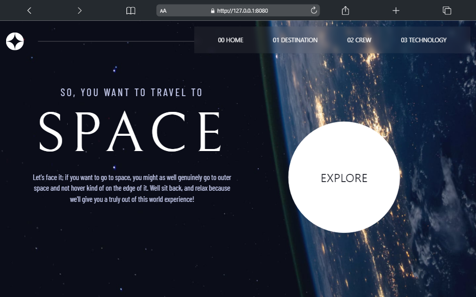

# Frontend Mentor - Space tourism website solution

This is a solution to the [Space tourism website challenge on Frontend Mentor](https://www.frontendmentor.io/challenges/space-tourism-multipage-website-gRWj1URZ3). Frontend Mentor challenges help you improve your coding skills by building realistic projects. 

## Table of contents

- [Overview](#overview)
  - [The challenge](#the-challenge)
  - [Screenshot](#screenshot)
  - [Links](#links)
- [My process](#my-process)
  - [Built with](#built-with)
  - [What I learned](#what-i-learned)
- [Author](#author)

## Overview

### The challenge

Users should be able to:

- View the optimal layout for each of the website's pages depending on their device's screen size
- See hover states for all interactive elements on the page
- View each page and be able to toggle between the tabs to see new information

### Screenshot



### Links

- Solution URL: [Add solution URL here](https://github.com/Damilarr/Space_tourism_website)
- Live Site URL: [Add live site URL here](https://Damilarr.github.io/Space_tourism_website)

## My process

### Built with

- HTML5 markup
- CSS custom properties
- Flexbox
- Mobile-first workflow
- Bootstrap
- JavaScript

### What I learned
I practiced fetching data from a LOCAL json file using the async function and also some Javascript Basics.
```js
 const getCrewData = async(index)=>{
    let response = await fetch('./data.json')
    let final = await response.json()
    setTimeout(() => {
        document.getElementById('crewRole').innerHTML = final.crew[index].role.toUpperCase()
        document.getElementById('crewImg').src = final.crew[index].images.webp
        document.getElementById('crewBio').innerHTML = final.crew[index].bio.toUpperCase()
        document.getElementById('crewName').innerHTML = final.crew[index].name.toUpperCase()
    }, 200);
 }
```
## Author

- Website - [EMMANUEL](https://github.com/Damilarr)
- Frontend Mentor - [@Damilarr](https://www.frontendmentor.io/profile/Damilarr)
- Twitter - [@Emmdam4](https://twitter.com/Emmdam4)
